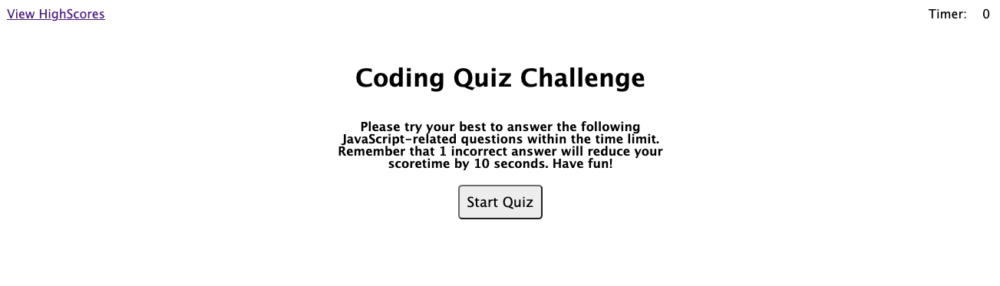
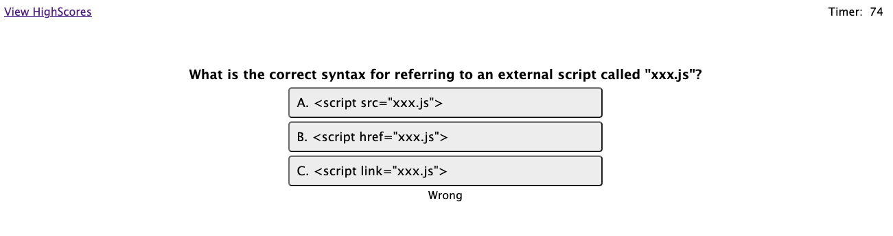
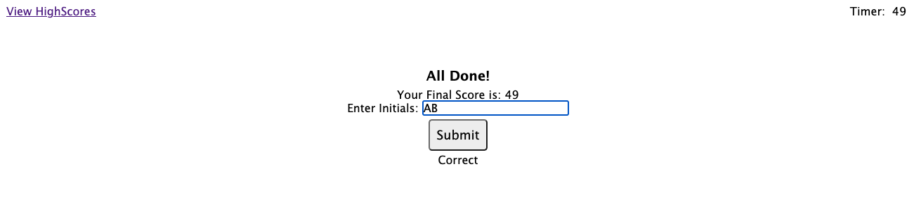
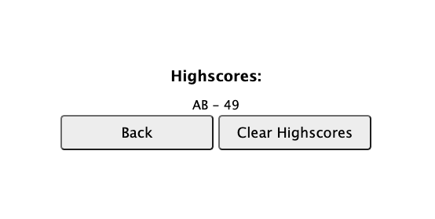

# Timed Quiz Website | HTML, CSS & JavaScript (DOM API)

## Description 
This site is built to test your basic knowledge on JavaScript, and stores the scores with the initials that the user entered. 

- When the website is first visited, a welcome page will show with intro to the quiz game and a timer, a link to view highscores 
- When clicking the star button, a timer starts to count down and the first question pops up 
- When a question is answered, the next question will follow
- If the wrong answer is clicked on, 10 secounds will be deducted from the timer
- When all questions are answered, the quiz is done and the user can submit their initials 
- After submitting the initials, the user is able to see all the scored stored in the local storage and the record just submitted

## Credits 
Shout out to my tutors Thomas and Chris!! 

## Screenshot of the app 

## Deployed link to the app

https://elenaliu0415.github.io/timed-quiz-website/

